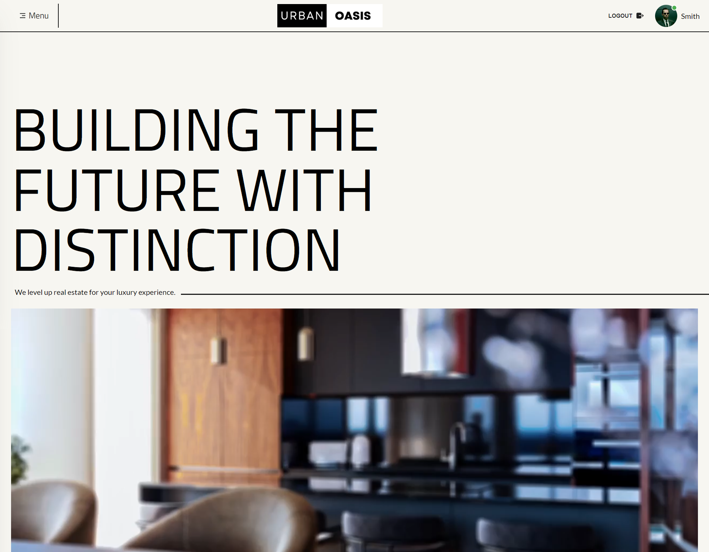

# Urban Oasis - MERN Stack based real estate website.

_UI Design done by\_ {Myself}_

### Live Site : [Website Link](https://urban-oasis-indev.web.app/)

### Server Site Repo : [Server Site Repository](https://github.com/dev-ahad-ali/urban-oasis-server)

#### Users To Check Out Website Features :

ADMIN

- **Email** : admin@admin.com
- **Password** : Admin$$$

AGENT

- **Email** : agent1@agent.com
- **Password** : Agent$$$

USER

- **Email** : user@user.com
- **Password** : User$$$

# Technology Used :

1. React
2. Tailwind Css
3. React Router
4. JavaScript
5. Axios
6. Firebase
7. Material Tailwind
8. React Hook Form
9. React Scroll Parallax
10. React Player
11. React Marque
12. React Icons
13. React Tostify
14. Vite

# About The Project :

## Overview :

A MERN stack based real estate website including functionalities for Admin, Agent and User to insure a smooth property buying and selling experience.

**This Website Contains** :

- Home page
- All properties page
- Login page
- Registrations page
- Admin Dashboard
- Agent Dashboard
- User Dashboard
- 404 Error page

## Features :

- User can search for property based on location.
- User can add properties to wishlist.
- User can make offers form properties offer must be between the given price.
- Upon the offer accepting user can pay the amount and buy the property.
- User can post reviews for properties.
- An agent can added properties to the website.
- An agent update his listed properties on the website.
- An agent can view all the offer made for his properties and accept the one he likes the most.
- Admin can verify or reject properties added by the agent.
- Admin can promote other users to admin or agent status.
- Admin can mark some as fraud.
- Admin can see all review post on the website and delete them.
- Admin can advertise properties on the home page.
